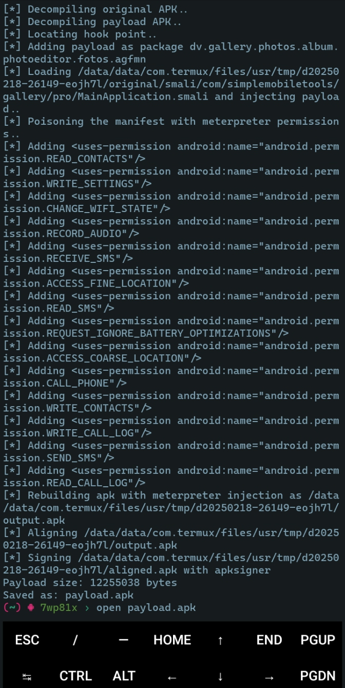

# MSFPatch

MSFPatch is a Bash script that fixes the `apktool` build error when injecting payloads into APKs using Metasploit on Termux.

## Installation & usage
```bash
cd ~/
pkg install git -y
git clone https://github.com/7wp81x/MSFPatch
cd MSFPatch
bash msfpatch.sh
```

## Screenshot


## Disclaimer
Use this tool responsibly. The author is not responsible for any misuse of this script.

